<p align="center">
  
</p>

<p align="center">
  <a href="https://github.com/kartikeyajay2006/Wispr_goa_task/actions/workflows/ci.yml"></a>
  
  
  
  
  
  
  
</p>

<h3 align="center">Delete a customer from every system, and prove it.</h3>

<p align="center">
Ask in plain words, or out loud: <i>"can you wipe Mira's data?"</i>. A LangGraph team of Claude-powered agents finds the person's records across PostgreSQL and object storage, rehearses the deletion on an isolated copy, backs everything up and reads it back, then <b>stops for a human</b> to approve <i>one exact plan hash</i>. After execution it rescans until nothing personal is left. Every step lands in a tamper-evident hash chain.
</p>

<p align="center">
  <a href="#quick-start"><b>Quick start</b></a> ·
  <a href="#what-happens-to-a-request"><b>How it works</b></a> ·
  <a href="#the-agents"><b>Agents</b></a> ·
  <a href="#demo-customers"><b>Demo customers</b></a> ·
  <a href="#a-tour-of-the-console"><b>Tour</b></a> ·
  <a href="#architecture"><b>Architecture</b></a> ·
  <a href="#http-api"><b>API</b></a>
</p>

<br>

<p align="center">
  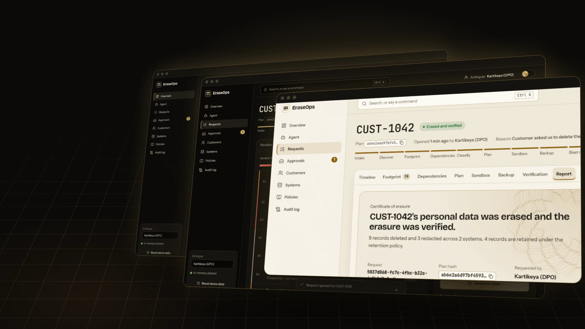
</p>

---

## Why this exists

A "right to erasure" request sounds like one `DELETE`. In practice the customer is spread across a dozen tables and buckets, some rows must legally be kept, some are shared with other customers, and nobody can prove afterwards that the data is really gone.

EraseOps treats erasure like a production change:

- **Agents do the legwork, people decide.** Claude agents investigate with read-only tools and prepare the plan; they have no tool that can delete anything.
- **Nothing is guessed.** A versioned retention policy decides, per table and bucket, whether data is deleted, redacted, or kept, and records why.
- **Nothing runs untested.** The plan is applied to an isolated copy first. On PostgreSQL that is a real transaction that is always rolled back, so the database enforces every foreign key itself.
- **Nothing runs unapproved.** A person types the customer ID to approve one SHA-256 plan hash. The approval expires and works exactly once.
- **Nothing is assumed.** After execution every system is rescanned. If anything personal remains, the request fails and offers a one-click rollback from the backup taken earlier.

## What happens to a request

| # | Step | What it does | Evidence it leaves |
|:-:|------|--------------|--------------------|
| 1 | **Discover** | Scans each allowlisted connector for rows and objects owned by the customer, including rows owned through a parent such as `order_items → orders` | Footprint with record IDs |
| 2 | **Classify** | Looks every resource up in the [retention policy](packages/policy-engine/src/retention-policy.ts). Unknown resources are retained and flagged | Legal basis per resource |
| 3 | **Rehearse** | Simulates the plan. Orphaned rows, changes to another customer's data, or leftover personal data block it | Sandbox report per system |
| 4 | **Back up** | Snapshots every affected row and object, then re-reads the copies and checks each SHA-256 | Verified backup manifest |
| 5 | **Approve** | A named operator types `CUST-xxxx` to approve the canonical plan hash. Single-use, expires (15 min by default) | Signed approval in the audit chain |
| 6 | **Execute** | Each connector runs only the approved, parameterized actions. Rate-limited per operator | Planned vs. changed counts |
| 7 | **Prove** | Rescans every system. Zero residual seals a certificate; anything left fails the request and enables rollback | Certificate of erasure and hash chain |

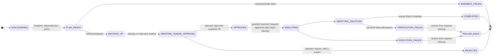
```mermaid
stateDiagram-v2
  direction LR
  [*] --> DISCOVERING
  DISCOVERING --> PLAN_READY: footprint, dependencies, policy
  PLAN_READY --> SANDBOX_FAILED: rehearsal finds harm
  PLAN_READY --> BACKING_UP: rehearsal passes
  BACKING_UP --> AWAITING_HUMAN_APPROVAL: backup re-read and verified
  AWAITING_HUMAN_APPROVAL --> APPROVED: operator types the customer ID
  AWAITING_HUMAN_APPROVAL --> REJECTED: operator rejects, with a reason
  APPROVED --> EXECUTING: guarded execute (request, approval, plan hash, identity)
  EXECUTING --> VERIFYING_DELETION
  EXECUTING --> EXECUTION_FAILED
  VERIFYING_DELETION --> COMPLETED: rescan finds 0 residual
  VERIFYING_DELETION --> VERIFICATION_FAILED: personal data still present
  EXECUTION_FAILED --> ROLLED_BACK: restore from request backup
  VERIFICATION_FAILED --> ROLLED_BACK: restore from request backup
  SANDBOX_FAILED --> [*]
  REJECTED --> [*]
  COMPLETED --> [*]
  ROLLED_BACK --> [*]
```

## The agents

The agents are a [LangGraph](https://langchain-ai.github.io/langgraphjs/) state graph inside the API ([`apps/api/src/agent/graph.ts`](apps/api/src/agent/graph.ts)). Claude (`claude-opus-5-5`, via the official Anthropic SDK) drives the nodes that need judgement; the irreversible steps stay deterministic and behind a person.

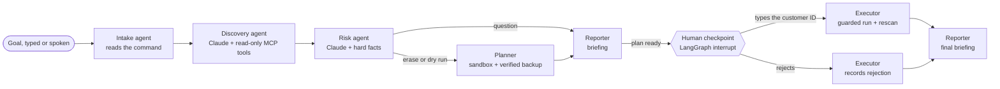
```mermaid
flowchart LR
  G([Goal, typed or spoken]) --> I[Intake agent<br/>reads the command]
  I --> D[Discovery agent<br/>Claude + read-only MCP tools]
  D --> R[Risk agent<br/>Claude + hard facts]
  R -->|erase or dry run| P[Planner<br/>sandbox + verified backup]
  R -->|question| B1
  P --> B1[Reporter<br/>briefing]
  B1 -->|plan ready| H{{Human checkpoint<br/>LangGraph interrupt}}
  H -->|types the customer ID| X[Executor<br/>guarded run + rescan]
  H -->|rejects| J[Executor<br/>records rejection]
  X --> B2[Reporter<br/>final briefing]
  J --> B2
```

| | |
|---|---|
| **Tools** | The discovery agent calls the EraseOps MCP catalog (`discover_customer_postgres`, `calculate_dependencies`, `rescan_customer`, ...). Destructive MCP tools are never declared to the model, and the MCP boundary refuses them anyway. |
| **Human in the loop** | `interrupt()` pauses the run with a checkpointed thread. Resuming needs the operator's identity and the typed customer ID; the executor then approves and runs the guarded path as that person. |
| **Grounded risk** | Deterministic facts (shared rows, retention holds, residual data) are merged with Claude's judgement: the model can raise risk but never drop a known blocker. |
| **Privacy** | Models see metadata and masked names ("Mira K."), never emails or values. Customer IDs a model invents are discarded. |
| **No key, no problem** | Without `ANTHROPIC_API_KEY` every node runs a rule-based twin, and the UI says which engine answered. Each Claude call uses server-side refusal fallbacks. |

<table>
  <tr>
    <td width="50%">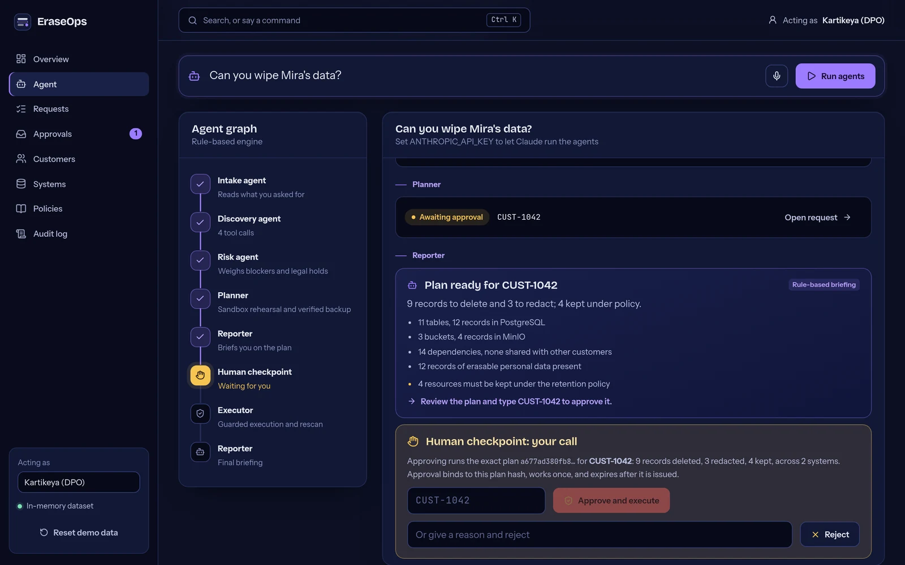<br><b>Paused at the human checkpoint.</b> The agents investigated and prepared the plan; nothing runs until a person types the customer ID.</td>
    <td width="50%">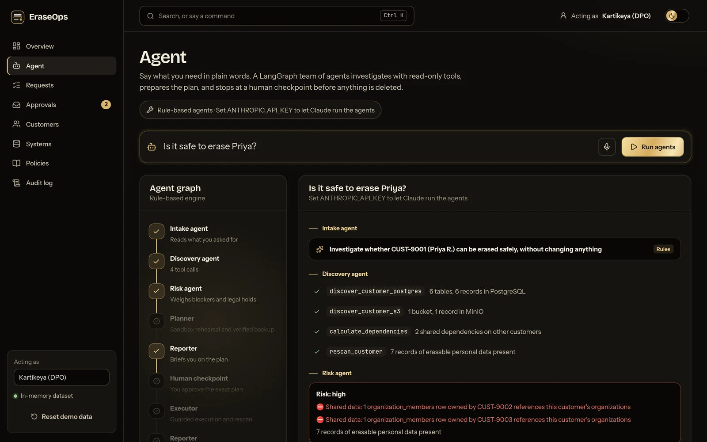<br><b>Read-only investigation.</b> "Is it safe to erase Priya?" ends with a high-risk briefing and no request opened.</td>
  </tr>
</table>

Presenting this? [`docs/DEMO.md`](docs/DEMO.md) has a three-minute script, what is AI versus deterministic, and answers to the questions judges ask.

## Demo customers

The demo ships a synthetic dataset, [`infra/fixtures/demo-dataset.json`](infra/fixtures/demo-dataset.json): eight customers, 76 rows across 13 tables, and 14 objects in 3 buckets. Every email uses the reserved `example.invalid` domain. **No customer is special-cased in code.** Each outcome below follows from the data itself, and you can edit the fixture to create new scenarios.

| Customer | What their data looks like | What EraseOps does |
|---|---|---|
| `CUST-1042` | Full footprint: profile, logins, 2 addresses, an order, support thread, analytics, 4 files | **Happy path.** 9 records deleted, 3 redacted, 4 retained for tax law; certificate issued |
| `CUST-2088` | Two orders with payments, three analytics events | Good for the **reject** path; nothing changes and the reason is audited |
| `CUST-3175` | 12 analytics events, 5 support messages, 5 files | **Large blast radius**; try it as a dry run first |
| `CUST-4410` | Only a login and a marketing profile | **Smallest erasure**, PostgreSQL only |
| `CUST-7001` | One upload is in `ARCHIVE` storage | **Blocked at backup.** An archived object can't be read back, so approval stays locked |
| `CUST-9001` | Owns workspace `ORG-501`, which two other customers belong to | **Blocked by the sandbox.** Deleting the workspace would orphan rows owned by `CUST-9002` and `CUST-9003` |
| `CUST-9002`, `CUST-9003` | Members of that shared workspace | Erasable: only their own membership row goes |
| `CUST-5555` | Not in any system | A clear `404` naming the systems that were searched |

## A tour of the console

<table>
  <tr>
    <td width="50%">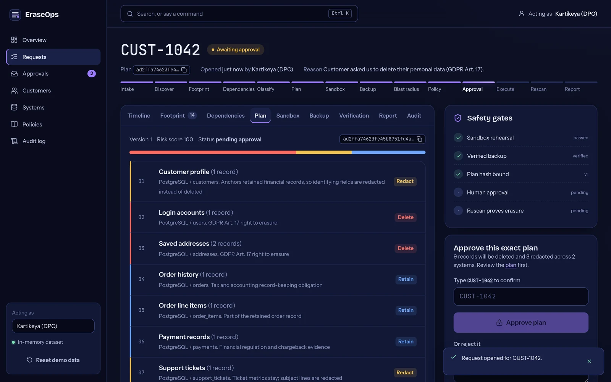<br><b>Plan and safety rail.</b> Each action shows its legal basis. Approval unlocks only when every gate is green and the operator types the customer ID.</td>
    <td width="50%">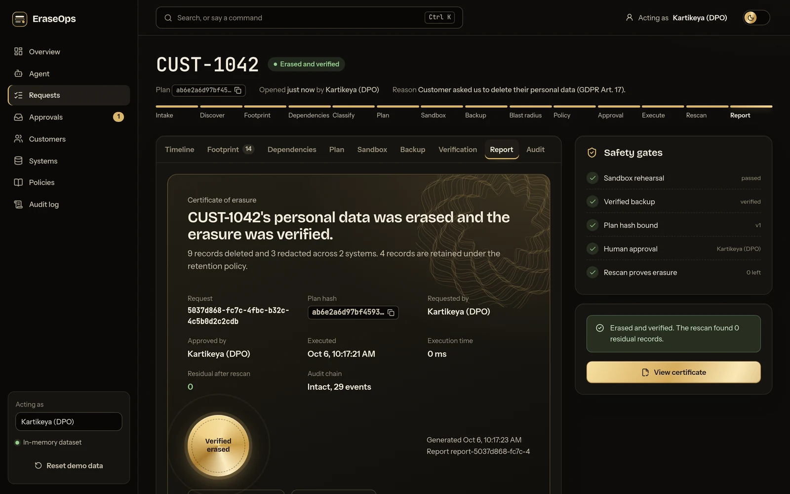<br><b>Certificate of erasure.</b> Approver, plan hash, execution time, residual count, and audit-chain status. Prints cleanly to PDF.</td>
  </tr>
  <tr>
    <td>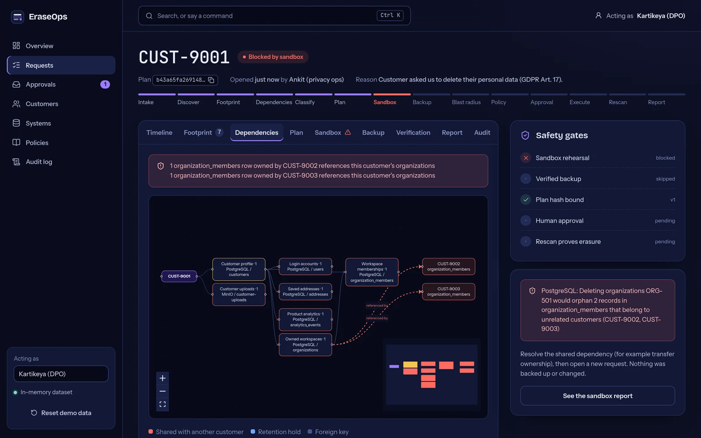<br><b>Dependency graph.</b> CUST-9001's workspace is referenced by two other customers, so the sandbox blocks the plan before any backup or approval.</td>
    <td>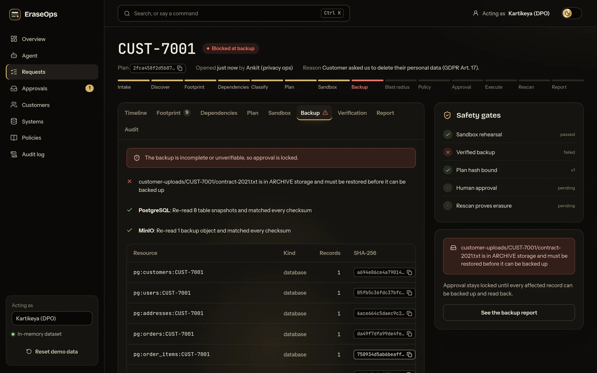<br><b>Backup gate.</b> An object in archive storage can't be read back and checksummed, so CUST-7001 never reaches approval.</td>
  </tr>
  <tr>
    <td>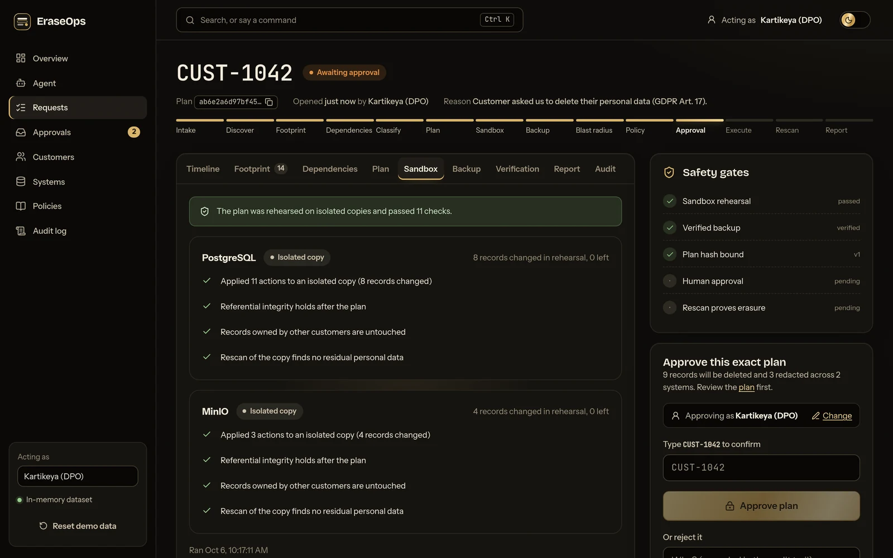<br><b>Sandbox report.</b> What the rehearsal changed, per system, and the integrity, isolation and residual checks it passed.</td>
    <td>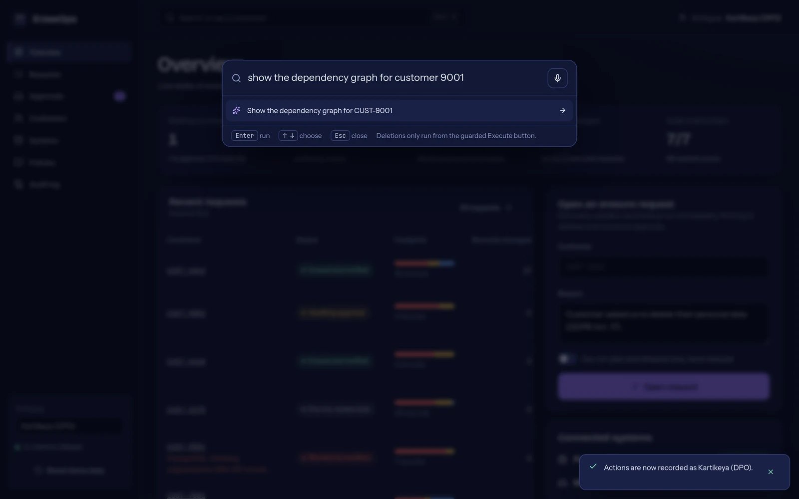<br><b>Voice command bar.</b> <kbd>Ctrl</kbd>/<kbd>⌘</kbd>+<kbd>K</kbd>, then type or speak. It reads the command back before acting and can never execute a deletion.</td>
  </tr>
  <tr>
    <td>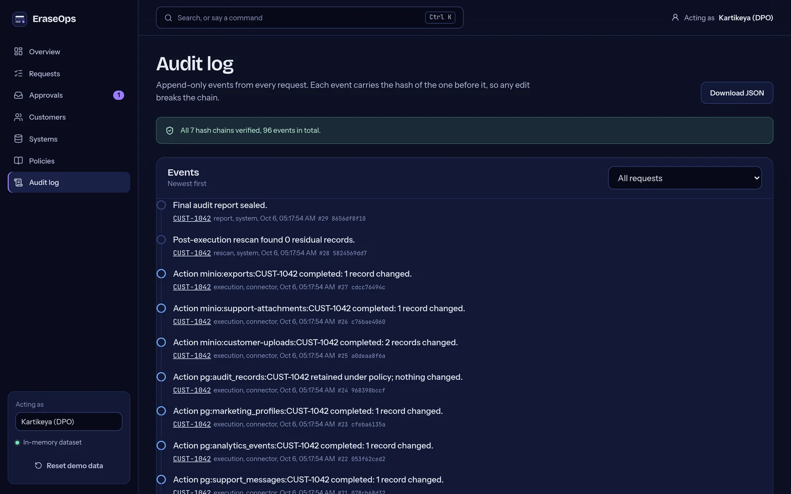<br><b>Audit log.</b> Append-only events across every request. Each carries the previous event's hash, so any edit breaks the chain.</td>
    <td>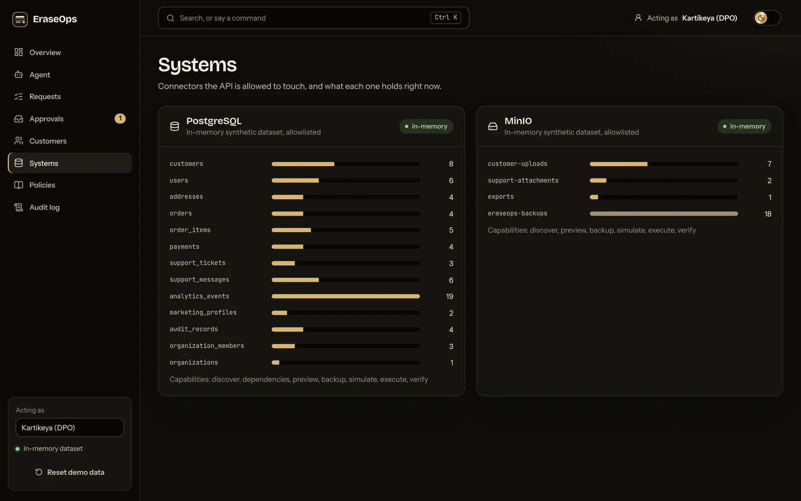<br><b>Systems.</b> Live inventory per table and bucket. Watch the counts drop after an erasure and the backup bucket grow.</td>
  </tr>
  <tr>
    <td>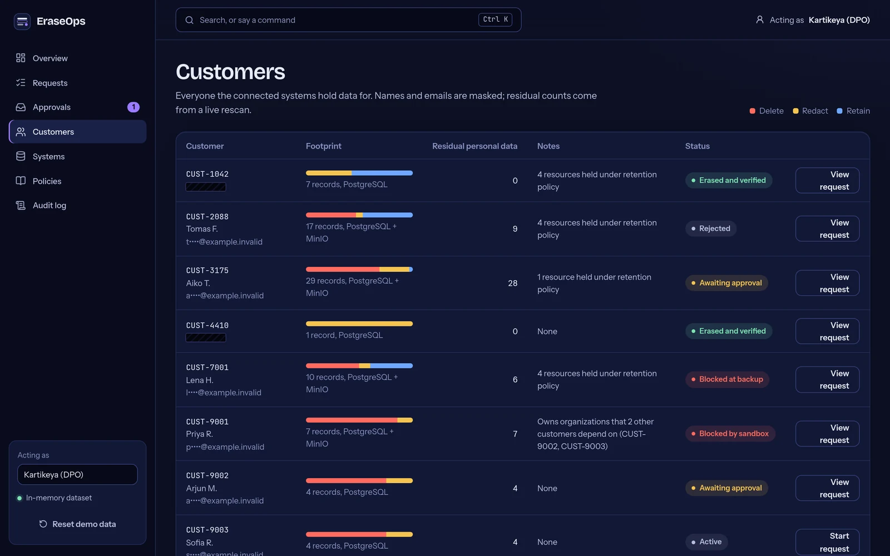<br><b>Customers.</b> Masked identities, footprint by policy, and a residual count from a live rescan. An erased customer's avatar turns into a redaction swatch.</td>
    <td>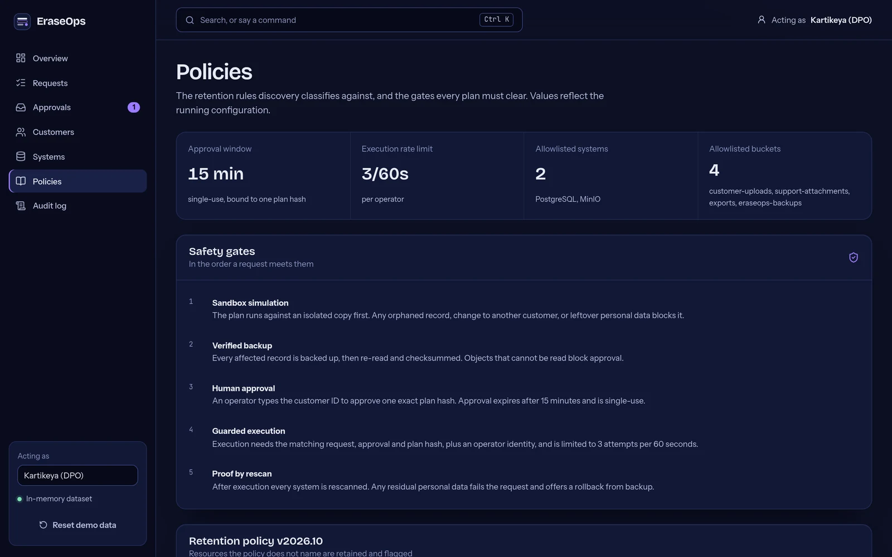<br><b>Policies.</b> Retention rules and the limits the running API enforces, read from its configuration.</td>
  </tr>
</table>

<p align="center">
  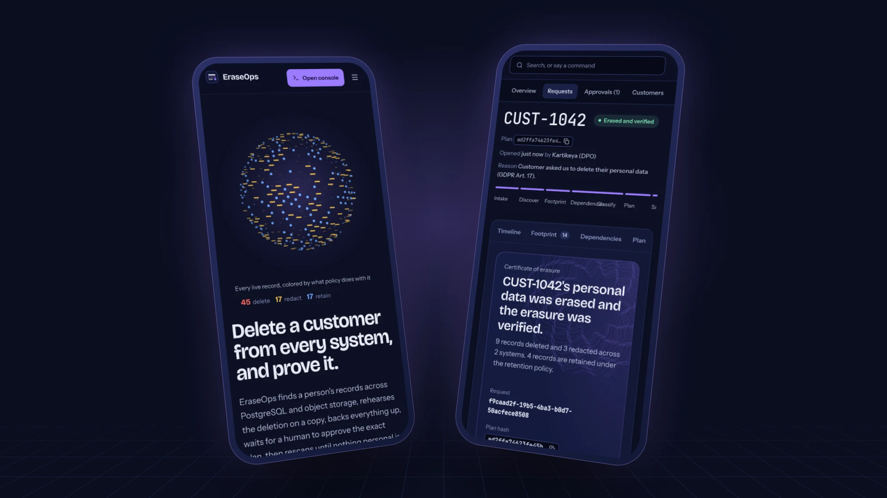
  <br><sub>Responsive down to phone width. The landing page's 3D record sphere is drawn from live record counts.</sub>
</p>

## Two papers: Onyx and Vellum

The console is designed like security printing: gold foil for proof, black ink for redaction, guilloche linework on the certificate. **Onyx** (dark, default) and **Vellum** (cream and gold) are one click apart: the toggle in the top bar repaints the page with a circular reveal, and the choice is remembered. Status colours carry meaning only (vermilion deletes, copper redacts, stone retains, sage verifies), and both themes pass an automated WCAG AA audit.

<table>
  <tr>
    <td width="50%">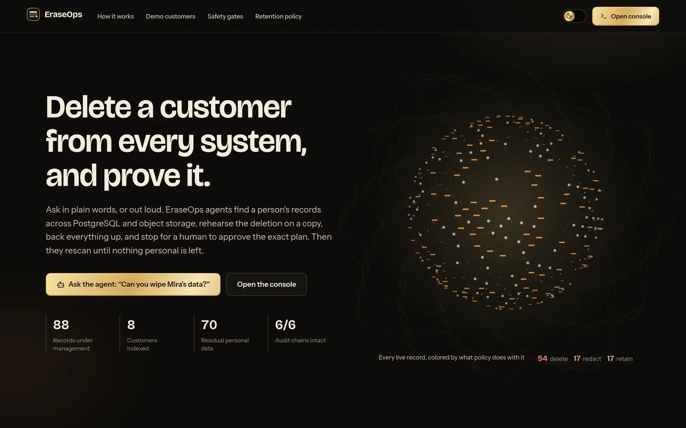<br><b>Onyx.</b> The landing page reveals its headline from under redaction bars; every number and every point on the sphere is live.</td>
    <td width="50%">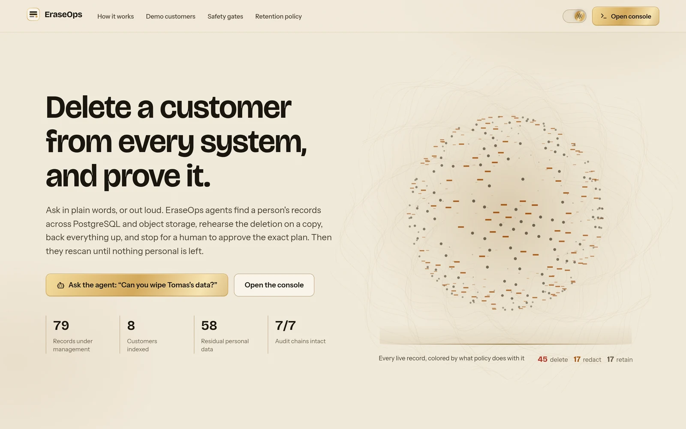<br><b>Vellum.</b> The same page on cream paper with burnished gold.</td>
  </tr>
  <tr>
    <td>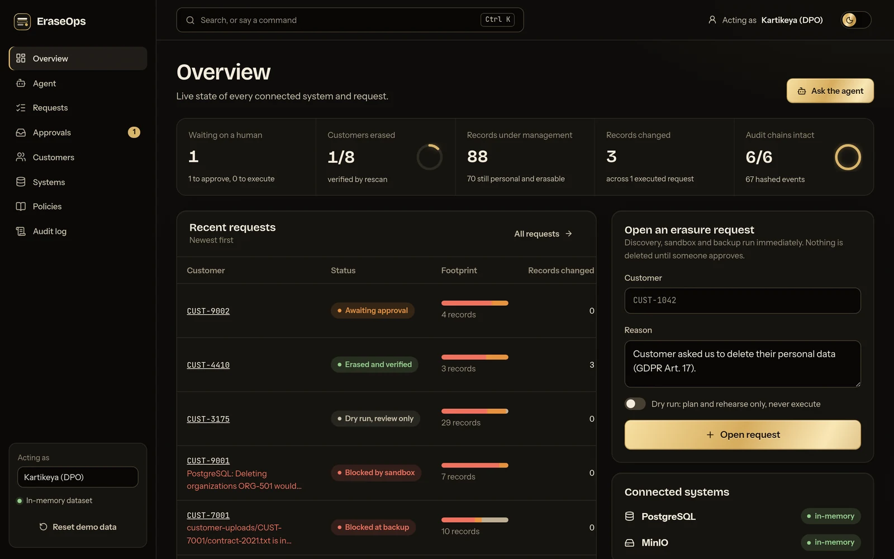<br><b>Overview, onyx.</b> Counts animate in, rings show erasure and audit-chain health.</td>
    <td>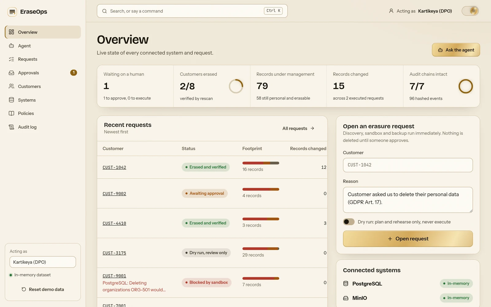<br><b>Overview, vellum.</b></td>
  </tr>
</table>

## Quick start

**Requirements:** Node.js 20.12 or newer. Docker is optional.

```bash
npm install
npm run dev
```

Open **http://localhost:5173** for the landing page and **http://localhost:5173/console** for the operator console. The API listens on `http://localhost:3001`.

To let Claude run the agents and read commands, start with a key: `ANTHROPIC_API_KEY=sk-ant-... npm run dev`. Without one, the same agents run on deterministic rules.

The default mode keeps the synthetic dataset **in memory**. Deletions are real (discovery after an erasure finds nothing), but nothing leaves your machine. **Reset demo data** in the sidebar restores the fixture.

### Run against real PostgreSQL and MinIO

```bash
docker compose up -d          # PostgreSQL 16 + MinIO, schema from infra/postgres/*.sql
npm run seed:local            # load the same fixture into both services
CONNECTOR_MODE=local npm run dev
```

In local mode the sandbox runs inside a PostgreSQL transaction that is always rolled back, backups are written to the `eraseops-backups` bucket and re-read, and rollback restores rows (parents first) and objects from that backup. Add `ERASEROPS_PERSISTENCE=postgres` to persist workflows in the `eraseops_requests` table.

### Scripts

| Command | What it does |
|---|---|
| `npm run dev` | API (auto-reload) and web app together |
| `npm run dev:mcp` | MCP server over stdio for agent clients |
| `npm run seed:local` | Load the fixture into the Docker services |
| `npm test` | Unit, contract and HTTP lifecycle tests |
| `npm run test:integration` | The same flows against the Docker services |
| `npm run typecheck` | Project-wide `tsc -b` |
| `npm run build` | Typecheck, then production web build |

## Architecture

<p align="center">
  
</p>

| Piece | Where | Role |
|---|---|---|
| Operator console | [`apps/web`](apps/web) | React 18, React Query, React Router, React Flow; code-split per route |
| Agents | [`apps/api/src/agent`](apps/api/src/agent) | LangGraph.js state graph, Claude tool loop over MCP tools, command interpreter, rule-based twins |
| API | [`apps/api`](apps/api) | Express routes over `WorkflowService` (create, approve, reject, execute, rollback), live read models, server-sent events for agent runs |
| MCP server | [`apps/mcp-server`](apps/mcp-server) | JSON-RPC over stdio; destructive tools need injected authorization bound to the plan hash |
| Connectors | [`packages/connectors`](packages/connectors) | Mock connectors over a stateful dataset, and real PostgreSQL/MinIO adapters (SigV4 client, no SDK) driven by one schema registry |
| Policy engine | [`packages/policy-engine`](packages/policy-engine) | Retention policy, execution preconditions, destructive-request identity checks |
| Sandbox | [`packages/sandbox`](packages/sandbox) | Merges static plan checks with each connector's simulation report |
| Backup, audit, report | [`packages/backup`](packages/backup), [`packages/audit`](packages/audit), [`packages/report`](packages/report) | Checksummed manifests, SHA-256 hash chain, certificate data |
| Python backend | [`backend`](backend) | FastAPI, SQLAlchemy and a Python LangGraph reference graph of the same workflow, with its own tests (`pytest backend`) |

## Safety model

- **Allowlists first.** Connectors only touch configured systems, hosts and buckets. `DEMO_MODE` must be `true`; production credentials are refused.
- **Metadata at the boundary.** Discovery returns table names, counts and record IDs, never values. Names and emails are masked in every read model.
- **Parameterized everything.** Every discovery, erasure and rescan query binds the customer as `$1`; table and column identifiers come only from the schema registry, never from input.
- **One guarded execution route.** `POST /api/requests/:id/execute-guarded` needs the request ID, approval ID, plan hash and an `x-operator-identity` header, and is rate-limited. The legacy `/execute` route answers `410 Gone`.
- **Approval is narrow.** Bound to one plan hash, single-use, and time-boxed (`APPROVAL_TTL_MINUTES`). Dry runs can never be approved.
- **Agents cannot delete.** Agent tools are read-only MCP calls made with `approved: false`; a destructive tool name is refused at the boundary. Only a resumed human checkpoint reaches the guarded route.
- **Proof, not trust.** Execution goes through the connector that owns the data, and a connector that claims success without deleting is caught by the rescan (there is a test for exactly that).
- **Tamper evidence.** Each audit event hashes its predecessor, and `GET /api/audit` re-verifies every chain. The PostgreSQL schema also ships an append-only `eraseops_audit_events` table whose trigger rejects `UPDATE` and `DELETE`.

More detail in [`docs/SECURITY.md`](docs/SECURITY.md).

## Voice and command bar

Press <kbd>Ctrl</kbd>/<kbd>⌘</kbd>+<kbd>K</kbd> anywhere in the console, or use the microphone on the **Agent** page. Speech comes from the browser's Web Speech API (Chrome, Edge, Safari). Clear commands are read instantly in the browser; loose phrasing such as "can you forget Arjun's data?" goes to the interpreter, where Claude (or the rule-based reader) resolves names and spoken IDs ("customer 10 42") and reads the result back before anything happens.

| Say or type | Result |
|---|---|
| `erase customer 1042` · `can you wipe Mira's data?` | Opens a request (discovery, sandbox, backup) |
| `is it safe to erase Priya?` | Runs the agents as a read-only investigation |
| `dry run for cust 3175` | Opens a review-only dry run |
| `show the dependency graph for customer 9001` | Opens that request on the graph tab |
| `verify deletion` · `open the report` · `show the plan` | Switches tabs on the current request |
| `approve` · `reject` · `roll back` | Focuses the matching control. It never acts on its own |
| `go to approvals` · `open the audit log` | Navigates |
| `delete now` · `execute` | Refused. Deletions only run from the guarded button |

## HTTP API

| Method | Path | Purpose |
|---|---|---|
| `GET` | `/health` | Mode and allowlisted systems |
| `GET` | `/api/overview` | Counts, residual personal data, audit chain health |
| `GET` | `/api/customers` | Every known customer with masked identity, live footprint and latest request |
| `GET` | `/api/systems` | Connector status and per-table/bucket inventory |
| `GET` | `/api/policies` | Retention rules, safety gates, active limits |
| `GET` | `/api/audit` | Cross-request event log with chain verification |
| `GET` / `POST` | `/api/requests` | List requests / open one `{customerId, reason, dryRun}` |
| `GET` | `/api/requests/:id` | Full workflow snapshot |
| `POST` | `/api/requests/:id/approve` | `{confirmation: "CUST-xxxx"}` + operator header |
| `POST` | `/api/requests/:id/reject` | `{reason?}` + operator header |
| `POST` | `/api/requests/:id/execute-guarded` | `{approvalId, planHash}` + operator header |
| `POST` | `/api/requests/:id/rollback` | Restore from the request backup after a failed run |
| `GET` | `/api/requests/:id/{plan,sandbox,backup,blast-radius,verification,report,metrics,audit,persistence,authoritative}` | Evidence views; `verification` rescans live |
| `GET` | `/api/assistant/status` | Which engine reads commands and runs agents (Claude model or rules) |
| `POST` | `/api/assistant/interpret` | `{text}` to one structured intent with a read-back sentence |
| `POST` | `/api/agent/runs` | `{goal}`; streams the LangGraph run as server-sent events until it finishes or reaches the human checkpoint |
| `POST` | `/api/agent/runs/:id/resume` | `{decision: "approve" \| "reject", confirmation, reason}` + operator header; streams the rest of the run |
| `GET` | `/api/agent/runs` | Recent agent runs with status and linked request |
| `POST` | `/api/demo/reset` | Restore the fixture (in memory, or reseed Docker in local mode) |

```bash
# erase CUST-4410 from the command line
ID=$(curl -s -XPOST localhost:3001/api/requests -H 'content-type: application/json' -H 'x-operator-identity: you' \
  -d '{"customerId":"CUST-4410","reason":"Customer asked to be forgotten","dryRun":false}' | jq -r .requestId)
APPROVAL=$(curl -s -XPOST localhost:3001/api/requests/$ID/approve -H 'content-type: application/json' -H 'x-operator-identity: you' -d '{"confirmation":"CUST-4410"}')
curl -s -XPOST localhost:3001/api/requests/$ID/execute-guarded -H 'content-type: application/json' -H 'x-operator-identity: you' \
  -d "$(echo $APPROVAL | jq '{approvalId: .approval.token, planHash: .plan.hash}')" | jq '{state, verification}'
```

## Configuration

Copy [`.env.example`](.env.example) to `.env`; the API loads it on start, and real environment variables win.

| Variable | Default | Meaning |
|---|---|---|
| `API_PORT` | `3001` | API port (the Vite proxy follows it) |
| `CONNECTOR_MODE` | `mock` | `mock` (in-memory dataset) or `local` (Docker services) |
| `ERASEOPS_DATASET_FILE` | bundled fixture | Point mock mode at your own dataset |
| `ALLOWLIST_SYSTEMS` / `_HOSTS` / `_BUCKETS` | see file | What connectors may touch |
| `APPROVAL_TTL_MINUTES` | `15` | How long an approval stays valid |
| `DESTRUCTIVE_RATE_LIMIT` / `_WINDOW_SECONDS` | `3` / `60` | Execution attempts per operator per window |
| `ERASEROPS_PERSISTENCE` | `memory` | `postgres` stores workflows in PostgreSQL |
| `DATABASE_URL`, `MINIO_*` | match `docker-compose.yml` | Local infrastructure |
| `CORS_ORIGIN` | `*` | Comma-separated allowed origins |
| `ANTHROPIC_API_KEY` | unset | Lets Claude run the agents and read commands |
| `ERASEOPS_AI` | `auto` | `auto` (Claude when a key is set), `claude` (force, e.g. with an `ant auth login` profile), or `off` |
| `ERASEOPS_MODEL` | `claude-opus-5-5` | Model used by every agent |

## Project layout

```text
apps/
  api/            Express API: WorkflowService, read models, guarded routes
    src/agent/    LangGraph agents, Claude client, command interpreter, MCP-backed tools
  web/            React console and landing page
  mcp-server/     MCP tools over stdio
packages/
  connectors/     schema registry, stateful dataset, mock + PostgreSQL/MinIO adapters, local seeder
  policy-engine/  retention policy and execution preconditions
  sandbox/ backup/ audit/ report/ workflow/ execution/ approval/ blast-radius/ storage/ shared/
infra/
  fixtures/       synthetic dataset (single source for mock and local modes)
  postgres/       schema migrations run by docker compose
backend/          Python reference implementation (FastAPI, SQLAlchemy, LangGraph)
docs/             security notes and README assets
```

## Testing

```bash
npm run typecheck && npm test && npm run build
npm run test:integration          # needs docker compose up -d
pip install -r backend/requirements.txt && pytest backend
```

The agent suite runs the whole LangGraph flow with a scripted model: tool choice, a refused destructive call, the human checkpoint, resume, rejection, and fallback to rules when Claude fails mid-run. The TypeScript suite also covers plan hashing, approval expiry and reuse, the state machine, connector parameterization, data-driven sandbox failures, backup tamper detection, rollback restoring every row and object, cross-customer isolation, rate limiting, audit-chain tamper detection, and full HTTP lifecycles against a listening server. The integration suite repeats erase, verify and restore against real PostgreSQL and MinIO.

## How this was built

EraseOps was built by **Kartikeya Yadav** and **Ankit Pandey**. We used AI coding assistance (Claude Code) during development, including for the stateful connectors, the LangGraph agents and the console. Every feature is covered by the test suites above, which run in CI on every push, and [`docs/DEMO.md`](docs/DEMO.md) explains the design decisions.

---

<p align="center"><sub>Synthetic demo data only. EraseOps refuses to run outside demo mode and never needs production credentials.</sub></p>
